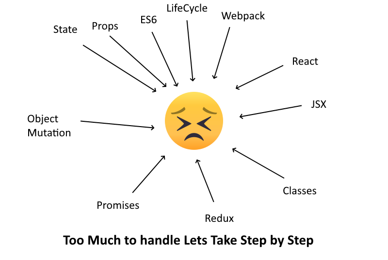
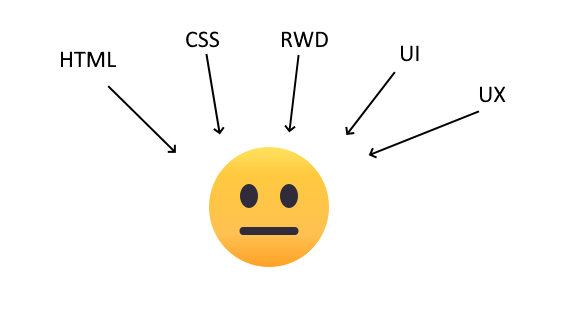
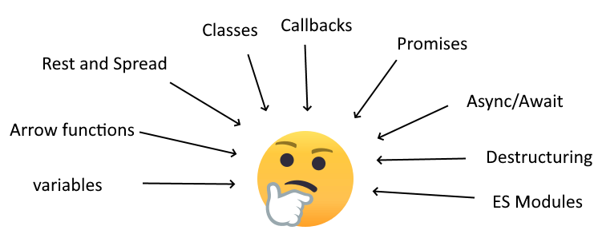
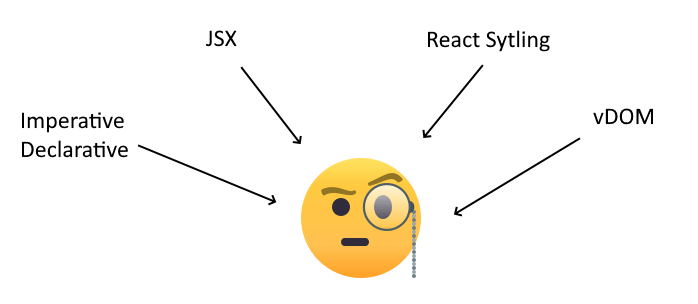
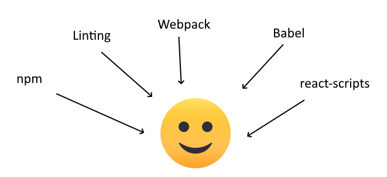
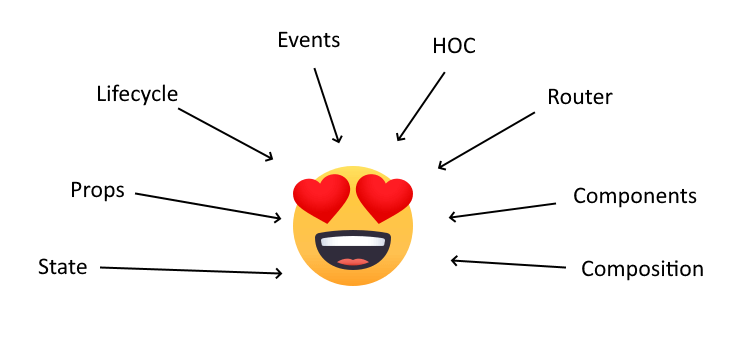
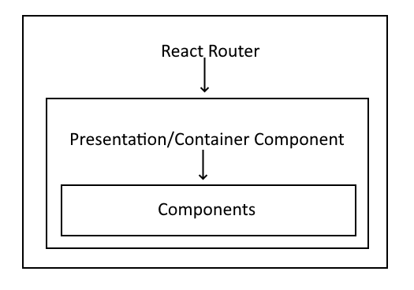
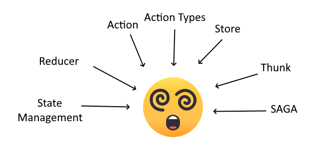
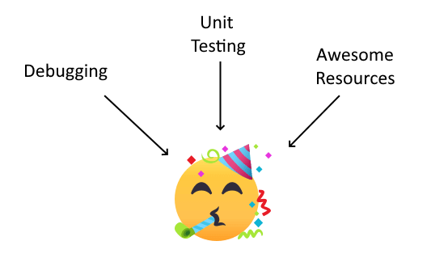

> Read Through [Flavio Copes React Handbook](https://flaviocopes.nyc3.digitaloceanspaces.com/react-handbook/react-handbook.pdf) to progress at an ultra-fast pace

# Overview
This is a quick guide to ramp up to ReactJS by beginning with essential HTML CSS and JavaScript knowledge to code in React. 

Initially, when I started ReactJS without knowing ES6, It was a lot to grasp and difficult wrap thing around in the head. The Pathway below is designed to be efficient in HTML, CSS and JS first. This is important as Learning react may look easy but while coding if the core of JavaScript is not clear, you will have huge trouble in debugging the code.



As you move along the parts, you don't directly start ReactJS coding, instead, you first have to get accustomed to syntax like JSX, CSS as Objects and way to think before writing in ReactJS. Understand first what React does with light DOM using virtual DOM. Once, your mind is prepared, learning React becomes a hell lot easier. As you know React is just a library and final product (i.e. websites) is an amalgamation of architecture and various technologies which are add-ons to React Library. Improper knowledge of this amalgamation results in destructive self-growth in frontend technology.

## Part 1: Understanding HTML and CSS relation to Browser
This is the first and foremost part every developer working with a website should know. Forget JavaScript right now. JavaScript only won't make content appear on to browser but HTML and CSS will.



Young developers are directly moved to React and Angular and that is a big red indicator for their personal skill development. It's not young developers are bad at HTML/CSS. The major problem is not HTML/CSS but the exposure they are given to it. While taking interview many candidates directly jump on to technologies like Angular and ReactJS (JavaScript Framework) without understanding the internal workings of HTML and CSS.

Everything you see on the web is built on HTML and CSS. JavaScript only gives the interactiveness to a site. Now in the modern age, the site needs to work as an App. So JavaScript Frameworks and libraries are made to make the site work as an app. There is a major practice problem such that developers get too much involved in framework JS. I have heard developers losing grip on HTML and CSS as tickets have major work on App improvements bit and not UI changes. I recommend developers to practice on developing an app from scratch, once a month, so they get the full insight of how web architecture of SPA and PWA workaround to generate HTML light DOM and CSS.

### Content
- [Clear Introduction](/html-css/clear-introduction)
- [HTML](/html-css/html)
- [CSS](/html-css/css)
- [Developer's insight into UI and UX](/html-css/developers-insight-into-ui-ux)
- [Essential HTML and CSS for SPA](/html-css/essential-html-css-for-spa)

## Part 2: Core of JavaScript



Once your core of javascript is strong, you can work in any front end framework with ease. Using this knowledge you could earn the most merit in Web development on Apps like SPA and PWA. Many developers in the interview study a lot on React and redux but fail to answer the core mechanisms on how an object works. 70% of developers in the interview who know redux, fail to answer below example
```js
const a = { name: 'abc' };
const b = a;
b.name = 'xyz';
console.log(a.name); // Output is 'xyz'. I don't want the object 'a' to change. How do I do that?
```
If you are unable to answer this, you need to make your core knowledge of JavaScript stronger as knowing Redux means NOTHING if you can't solve this.

### Content
- [Declaration, Datatypes and Type conversions](/core-of-javascript/declaration-datatypes-and-type-conversions)
- [Comparisions](https://javascript.info/comparison)
- [Operators](https://developer.mozilla.org/en-US/docs/Web/JavaScript/Guide/Expressions_and_Operators) (Majorly [Logical](https://javascript.info/logical-operators))
- [Loops and Conditions]()
- [Iterators and Generators](https://javascript.info/generators-iterators) ([Second Reference](https://developer.mozilla.org/en-US/docs/Web/JavaScript/Guide/Iterators_and_Generators))
- [Objects](https://javascript.info/object-basics)
- Data Structures
    - [Arrays](https://javascript.info/array)
    - [Map and Set](https://javascript.info/map-set)
    - [WeakMap and WeakSet](https://javascript.info/weakmap-weakset)
    - [Date](https://javascript.info/date)
- [Destructuring assignment](https://javascript.info/destructuring-assignment)
- [Functions, Arrow Function and binding](/core-of-javascript/functions-arrow-functions-and-binding)
- [Decorators and Forwarding](https://javascript.info/call-apply-decorators)
- [ProtoType and Prototypal Inheritance](https://javascript.info/prototypes)
- [Understanding Scope](https://scotch.io/tutorials/understanding-scope-in-javascript)
- [What is Closure?](https://medium.com/javascript-scene/master-the-javascript-interview-what-is-a-closure-b2f0d2152b36)
- [Error Handling](https://javascript.info/error-handling)
- [Asynchronous (Kronos - Titan of Time) JavaScript](https://developer.mozilla.org/en-US/docs/Learn/JavaScript/Asynchronous)
    - [Scheduling: setTimeout and setInterval](https://javascript.info/settimeout-setinterval)
    - [Callbacks, Promises, Async/Await](https://javascript.info/async)
    - [Async Iterators and Generators](https://javascript.info/async-iterators-generators)
    - [AJAX](https://javascript.info/network)
- [ES6 Modules](https://javascript.info/modules)
- [Classes](https://javascript.info/classes)
- [Understanding Event Loop](https://flaviocopes.com/javascript-event-loop/) ([Second Reference](https://blog.carbonfive.com/the-javascript-event-loop-explained/))
- [DOM Tree](https://javascript.info/dom-nodes)
- [Storage](https://javascript.info/data-storage)
- [Native Event Binding with attributes](https://javascript.info/introduction-browser-events)
- [Airbnb Coding Style](https://github.com/airbnb/javascript)
- Tests (In Progress)

> Do not Start the Below section unless you have completed the Core of JavaScript

## Part 3: Adjusting to React



Starting coding in react project directly is a bad practice and should be avoided. We have to first modulate the mind's approach on how to relating desired HTML and CSS output with the component. While coming in from imperative ecosystem like jQuery, you have to tweak your mind to think in a declarative fashion to start working with React. Below are the steps to do so.

### Content

- [Introduction](https://jaxenter.com/introduction-react-147054.html)
- [Imperative and Declarative](https://codeburst.io/declarative-vs-imperative-programming-a8a7c93d9ad2)
- [Understanding vDOM](https://bitsofco.de/understanding-the-virtual-dom/) ([Build it to understand it](https://dev.to/ycmjason/building-a-simple-virtual-dom-from-scratch-3d05))
- [Adopting JSX writing style](https://www.w3schools.com/react/react_jsx.asp)
- [Bending CSS to Objects](https://www.w3schools.com/react/react_css.asp)
- [Ways of Styling in React](https://blog.bitsrc.io/5-ways-to-style-react-components-in-2019-30f1ccc2b5b)
- [Thinking in React](https://reactjs.org/docs/thinking-in-react.html)
- [Hello World with CDNs](/react/hello-world-with-cdns)

## Part 4: Prerequisites of React



In the previous part's final chapter, you saw how ReactJS with JSX is compiled using libraries like React, React DOM and babel. That example was good for small applications. However, while working on a bigger project a compiled version is required offload client resources for compilation and improve performance in loading. Hence we first have to understand how to work with a node package manager(npm) and Webpack that collects the resource and compiles the JSX code.

### Content

- npm
    - [Saving and executing packages](https://www.sitepoint.com/beginners-guide-node-package-manager/)
    - [package.json options](https://flaviocopes.com/package-json/)
    - [environment variables](https://medium.com/@trekinbami/using-environment-variables-in-react-6b0a99d83cf5)
    - [Linting Config](https://medium.com/javascript-in-plain-english/set-up-react-js-with-eslint-prettier-and-airbnb-cc015363a7c7)
    - [react-scripts command](https://blog.logrocket.com/everything-you-need-to-know-about-react-scripts/)
- [Webpack](https://webpack.js.org/concepts/)
    - [Why Webpack](https://blog.andrewray.me/webpack-when-to-use-and-why/)
    - [Dev Server](https://medium.com/@imranhsayed/webpack-dev-server-b1010d01dba5)
    - [Babel](https://www.robinwieruch.de/webpack-babel-setup-tutorial/)
    - [Resource Import with Loaders](https://webpack.js.org/guides/asset-management/)
    - [Video Tutorials](https://www.youtube.com/watch?v=9kJVYpOqcVU)
- [Create React App](https://create-react-app.dev/docs/getting-started/)

## Part 5: Hierarchy of React



React is just a library. However, every ReactJS Project is designed with a hierarchy where the Apps.js load the react-router. Then the specific route load the presentation or container component and later these components load the operational components of the project. Here is a sample repo to showcase this organisation: https://github.com/meetajhu/react-spa-template.
Hence, the learning path below is organised in the same fashion to relate your workflow. This Hierarchy is further used to relate to usability and flow redux state management.



### Content
- [Router](https://reactrouter.com/web/guides/quick-start)
    - [Lazy Loading and Code Splitting](https://reactjs.org/docs/code-splitting.html)
- [Presentation and Container Components(also known a modules, views in other framework)](https://css-tricks.com/learning-react-container-components/#container-components)
- Components
    - [Rendering the JSX](https://itnext.io/react-jsx-rendering-4405d3a3d6c3)
    - [Loop and Conditional Rendering](/react/loop-and-conditional-rendering)
    - [Working with Props](https://itnext.io/what-is-props-and-how-to-use-it-in-react-da307f500da0)
    - [Composition vs Inheritance](https://reactjs.org/docs/composition-vs-inheritance.html)
    - [Passing the Data to Component: State and Lifecycle](https://itnext.io/react-understanding-state-lifecycle-d45df5d2cf3f) ([Second Reference](https://itnext.io/react-setstate-usage-and-gotchas-ac10b4e03d60))
    - [Interactions to Component: Events and State](https://developer.mozilla.org/en-US/docs/Learn/Tools_and_testing/Client-side_JavaScript_frameworks/React_interactivity_events_state)
        - [Handling Events](https://reactjs.org/docs/handling-events.html)
        - [Forms](https://reactjs.org/docs/forms.html) ([Second Reference](https://flaviocopes.com/react-forms/))
        - [Lifting State Up](https://reactjs.org/docs/lifting-state-up.html)
        - [Hooks](https://reactjs.org/docs/hooks-intro.html)
    - [Refering to DOM via React Refs](https://reactjs.org/docs/refs-and-the-dom.html)
    - [Higher-Order Components](https://reactjs.org/docs/code-splitting.html)
- [Tutorial](https://reactjs.org/tutorial/tutorial.html)
- [Summary of fundamentals](https://www.freecodecamp.org/news/all-the-fundamental-react-js-concepts-jammed-into-this-single-medium-article-c83f9b53eac2/)
        
## Part 6: Diffusing State Management onto React Architecture



Understand how a single state object works for maintaining the state of the entire website. 

### Content

- [The State of Immutability](https://medium.com/dailyjs/the-state-of-immutability-169d2cd11310)
- [Available State Management](https://openexpoeurope.com/the-10-best-tools-for-state-management-in-front-end/)
- [Redux](/state-management/redux)
    - [thunk](https://medium.com/@stowball/a-dummys-guide-to-redux-and-thunk-in-react-d8904a7005d3)
    - [SAGA](https://redux-saga.js.org/)
- [React Hooks vs Redux](https://tsh.io/blog/react-state-management-react-hooks-vs-redux/#:~:text=React%20state%20management%20%E2%80%93%20why%20is,result%20of%20the%20user's%20action)

## Part 7: Debugging, Testing and Resources



### Content

- [Debugging Tools](https://blog.logrocket.com/debug-react-applications-with-the-new-react-devtools/)
- [Unit Testing Tools](https://reactjs.org/docs/testing.html)
- [Resources](https://github.com/enaqx/awesome-react)
    
